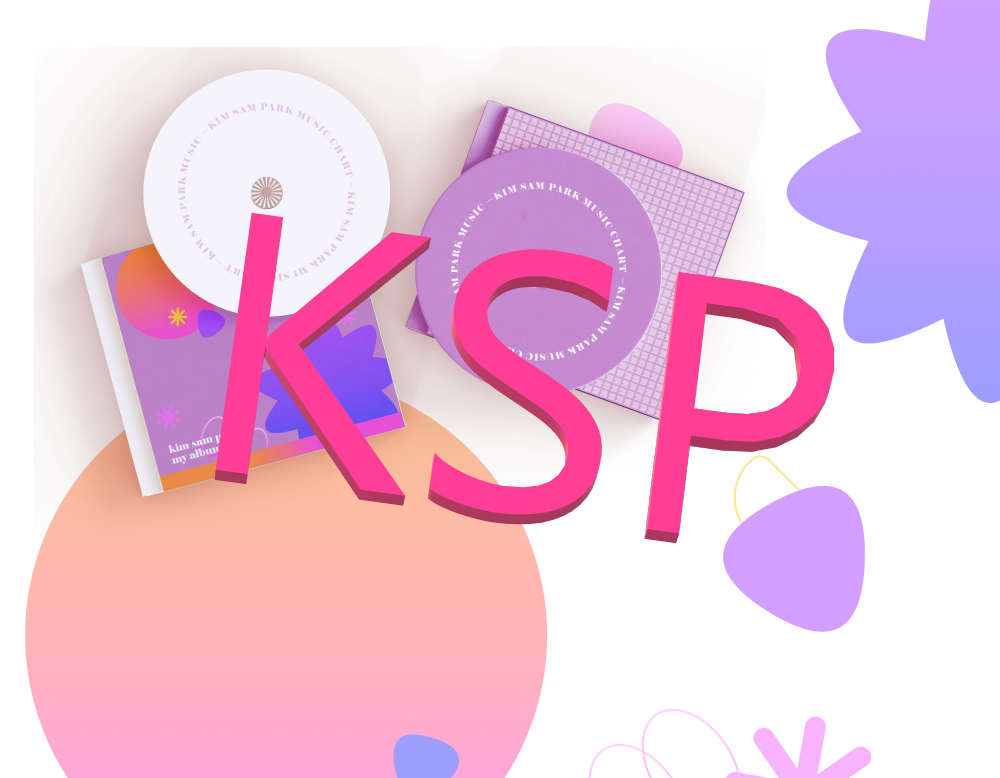

<h1> KSP (1st_Project_KSP) </h1>

<h1> 프로젝트 소개 (Project Described) </h1>
<h3> 1. 기획 의도 </h3>
이 프로젝트의 주제는 다른 모든 음원차트 사이트를 한곳에서 확인하고 서로 방명록처럼 소통할 수 있는 사이트를 만드는 것입니다.
 
The theme of this project is to create a site where you can check all the other music chart sites in one place and communicate with each other like a guestbook.

<h3> 2. 주요 기능 </h3>

|기능| 설명|
|:---|:---|
|Header|1. 로그인, 로그아웃, 회원정보 수정, 마이 페이지 이동 기능.|
|Main Page|1. 음악 실시간 Top 10. 2. 배경화면 랜덤 뮤직비디오 재생.|
|SignUp, Login, Logout|1. 아이디 중복 검사 기능. 2. 회원가입 유효성 검사 기능.|
|My Page|1. 프로필 사진 변경 기능. 2. 나의 음악 좋아요 리스트. 3. 내가 작성한 게시글.|
|All Chart Page|1. 오늘 날짜에 대한 음악 순위 제공. 2. 3개 사이트에 대한 네이버 검색량 비교 그래프.|
|Chart Page|1. 오늘 날짜에 대한 음악 순위 제공. 2. 시간에 따른 음악 순위 제공. 3. 페이지에 따른 보기 개수 변경 기능. 나의 음악 좋아요 체크 기능.|
|Board Page|1. 회원간의 자유게시판. 2. 게시판 글 작성 기능, 음악 및 사진 파일 업로드 기능. 3. 게시판 댓글, 대댓글 기능. 4. 본인 게시판 수정, 삭제 기능.|
|Manager Page|1. 관리자에 한해 수동 크롤링 기능 실행.|
|Crawling Function|1. 크롤링 실행 시 페이지에 따라서 Cheerio 또는 Puppeteer 기능 실행. 2. 앨범 이미지 서버에 저장 작업. 3. 데이터 수집 후 필요한 데이터에 맞춰서 데이터 가공 작업. 4. 가공한 데이터를 JSON 형식으로 서버에 저장.|

<h3> 3. 프로젝트 기간 (Project Work) </h3>
Date: 2022-12-13 ~ 2022-12-29 
Team members: 4 people 
Source Code Github Link: https://github.com/KimParkSam/1st_Project

<h3> 프로젝트 팀원 </h3>

|박현목(FE)|박효현(FE, BE)|박아름(FE, BE)|김미정(FE, BE)| 
|:---:|:---:|:---:|:---:|
||||| 
| |||| 

<h3> 4. 프로젝트 개선 기간 (Project Additional Work) </h3>
Date: 2022-12-30 ~ 2023-01-20 
Members: 1 people 
Source Code Github Link: https://github.com/doch2130/1st_Project_SeSAC_KSP

<h3> 프로젝트 팀원 </h3>

|박효현(FE, BE)| 
|:---:|
|| 
|| 

<h3> 5. 배포 사이트 </h3>

<h3> 6. 기술 스택 </h3>
<h3> Front-end </h3>

<h3> Back-end </h3>

<h3> 7. ErDiagram</h3>
<!--  -->

